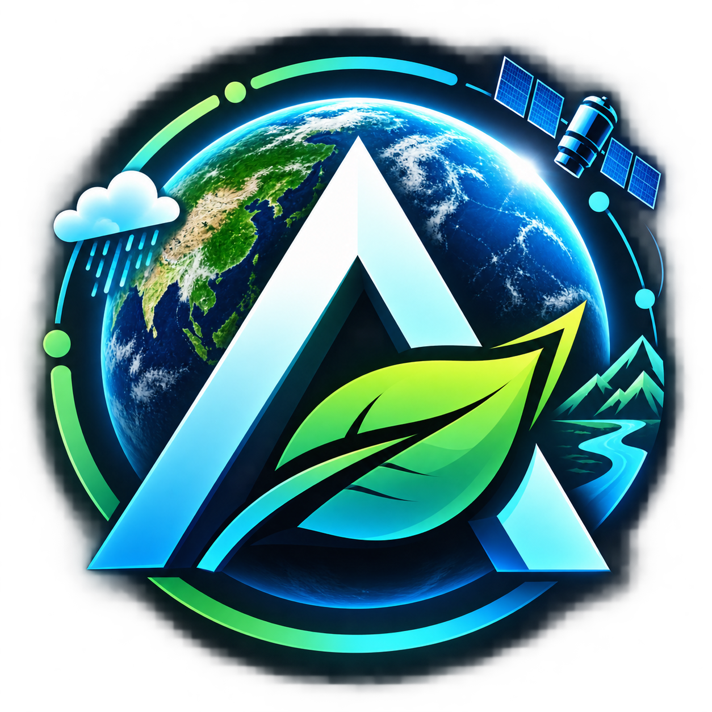

<div align="center">



# 🛡️ AEGIS-CLIMATE
### *Autonomous Multi-Agent Environmental & Climate Risk Intelligence Platform for Bharat*
**Translating Environmental Threats into Actionable Business & Civic Intelligence**

Built for **BHARAT AGENTIC 2026** (Powered by **AIKart** on **Unstop**)  
*12-Hour National Agentic AI Hackathon Sprint*

[](https://github.com/Niss54/AEGIS)
[](#-domain--bharat-impact)
[](#-system-architecture)
[](#-team-syntrix)
[](#-automated-testing)
[](#-hackathon-deliverables)

[📋 Hackathon Guidelines](./HACKATHON_GUIDELINES.md) · [📑 Product Requirements (PRD)](./PRD.md) · [📊 Pitch Deck](./docs/PITCH_DECK.md) · [🎬 Demo Script](./docs/DEMO_SCRIPT.md) · [🤖 Agent Manifest](./agent_manifest.yaml)

---

</div>

## 📌 Project Overview

**AEGIS-CLIMATE** is an autonomous, multi-agent environmental risk intelligence platform engineered specifically for the extreme climate vulnerabilities of **Bharat**. When catastrophic weather strikes — from sudden Mumbai cloudbursts and Bengaluru tech corridor inundations to Assam riverine breaches — civic authorities, infrastructure operators, and enterprise executives receive fragmented, delayed, and un-actionable information.

AEGIS bridges this operational gap by deploying **3 Autonomous AI Agents** coordinated through an **MCP Hub (Model Context Protocol)** and **LangGraph**:
1. **Agent 1 (Acute Physical Risk Agent):** Real-time flash flood classifier utilizing live Open-Meteo telemetry and a trained Gradient Boosting ML model (95.14% cross-validated accuracy).
2. **Agent 2 (Chronic Climate Vulnerability Agent):** 10–30 year geospatial infrastructure exposure modeling via 30m SRTM Digital Elevation Models (DEM), municipal drainage networks, and HAZUS depth-damage curves.
3. **Agent 3 (Macro Transition & Financial Risk Agent):** Enterprise Value-at-Risk (VaR), stranded asset auditing, and SEBI BRSR compliance auditing powered by ChromaDB RAG and multi-provider LLM reasoning.

---

## ⚡ Winning Highlights & Live AI Integrations

AEGIS-CLIMATE is integrated with live, authenticated production APIs:

| Technology / API | Role in AEGIS | Status |
| :--- | :--- | :--- |
| **Model Context Protocol (MCP)** | Decoupled JSON-RPC 2.0 tool execution (`initialize`, `tools/list`, `tools/call`, direct dispatch) | **Port 8001 & 8000 Active (10/10 Tests Pass)** |
| **Groq Cloud (LLaMA/GPT-120B)** | Sub-400ms ultra-fast reasoning monologue and dynamic executive alert generation | **Live Authenticated (0.34s latency)** |
| **Sarvam AI (`hi-IN`)** | Native Devanagari Hindi neural voice synthesis (`priya` speaker) for emergency broadcast | **Live Authenticated** |
| **ElevenLabs Voice** | Hyper-realistic English C-suite voice dispatch and boardroom alert streaming | **Live Authenticated** |
| **Mapbox Satellite HD** | High-resolution GIS basemap rasters and terrain elevation overlays | **Live Authenticated** |
| **Open-Meteo API** | 15-minute near-real-time precipitation, antecedent soil moisture, and temperature | **Live Community Telemetry** |

---

## 👥 Team Syntrix

| Name | Role in Team | Contact | Verification |
| :--- | :--- | :--- | :--- |
| **Nishant Maurya** | **Team Leader** (Full-Stack & Multi-Agent Architecture) | `+91 8840301998` | Verified ✅ |
| **Navya Chaudhary** | Core Member | `+91 9045659400` | Verified ✅ |
| **Om Tripathi** | Core Member | `+91 7905226392` | Verified ✅ |
| **Nikita Chopde** | Core Member | `+91 9343458471` | Verified ✅ |

---

## 🔄 Autonomous Agentic Execution Loop

```
Understand ───► Reason ───► Plan ───► Use Tools ───► Act ───► Deliver
```

1. **Understand:** Ingests live telemetry (rainfall vectors, soil saturation, humidity, 30m DEM elevation, and SEBI/NDMA policy corpus).
2. **Reason:** Probabilistic classification assessing whether physical hazard indices breach acute safety thresholds (>0.65).
3. **Plan:** LangGraph state graph dynamically schedules tool invocations across geospatial analysis and ChromaDB vector search.
4. **Use Tools:** Invocations routed via the **MCP Hub** (`fetch_weather_vectors`, `run_flood_classifier`, `compute_dem_exposure`, `query_policy_rag`).
5. **Act:** Cascades operational early warnings directly into structural degradation models and balance sheet Value-at-Risk.
6. **Deliver:** Streams real-time tokens over WebSockets to the Mission-Control Cockpit, synthesizes bilingual neural speech, and outputs print-ready C-suite PDF briefings.

---

## 🏛️ System Architecture

```
                  ┌──────────────────────────────────────────────┐
                  │       MISSION-CONTROL COCKPIT (VITE/REACT)   │
                  │ (Particle Canvas, Esri GIS Map, Audio Waves) │
                  └──────────────────────┬───────────────────────┘
                                         │ REST / WebSockets
                                         ▼
                  ┌──────────────────────────────────────────────┐
                  │            FASTAPI CORE ENGINE (Port 8000)   │
                  │   (/api/v1/analyze · /api/v1/bhasha/tts)     │
                  └──────────────────────┬───────────────────────┘
                                         │ JSON-RPC 2.0
                                         ▼
                  ┌──────────────────────────────────────────────┐
                  │        MCP HUB GATEWAY (Port 8001 & 8000)    │
                  │ (Dynamic Tool Registry · Official MCP Spec)  │
                  └──────┬────────────────┬───────────────┬──────┘
                         │                │               │
         ┌───────────────┘                │               └───────────────┐
         ▼                                ▼                               ▼
┌──────────────────┐            ┌──────────────────┐            ┌──────────────────┐
│     AGENT 1      │            │     AGENT 2      │            │     AGENT 3      │
│  ACUTE PHYSICAL  │            │ CHRONIC CLIMATE  │            │ MACRO TRANSITION │
│    RISK AGENT    │            │VULNERABILITY AGT │            │ & FINANCIAL RISK │
├──────────────────┤            ├──────────────────┤            ├──────────────────┤
│• Open-Meteo Live │ Score>0.65 │• GeoPandas + DEM │ High-Risk  │• ChromaDB RAG    │
│• XGBoost Model   │───────────>│• Drainage Matrix │───────────>│• Groq/Gemini LLM │
│• 15-min Refresh  │            │• HAZUS Exposure  │            │• Value at Risk   │
└──────────────────┘            └──────────────────┘            └──────────────────┘
```

---

## 🛠️ Complete Tech Stack

- **Agentic Protocol & Orchestration:** Model Context Protocol (MCP) JSON-RPC 2.0 Gateway, LangGraph StateGraph, Tool Handshake (`initialize`, `tools/list`, `tools/call`).
- **AI / ML & Speech Engines:** Groq Cloud (`openai/gpt-oss-120b`, `20b`), Google Gemini 1.5, Sarvam AI (`hi-IN`), ElevenLabs, Scikit-Learn (GradientBoostingClassifier).
- **Geospatial & Vision:** Leaflet.js, Esri World Dark Gray Canvas, GeoPandas, 30m SRTM DEM, Mapbox HD Satellite rasters.
- **Backend & APIs:** Python 3.12, FastAPI, Uvicorn, Pydantic v2, WebSockets, HTTPX.
- **Vector Database & Cache:** ChromaDB (policy vector embeddings), SQLite/PostGIS.
- **Frontend Command Center:** Vite + React + TypeScript, Vanilla CSS design system, HTML5 Constellation Particle Canvas, Audio Equalizer Waves, Telemetry Marquee Ticker.

---

## 🧪 Automated Testing & Verification

All test suites pass with 100% success rate:

```bash
# 1. Run Official MCP End-to-End Test Suite (10/10 Tests)
py -3.12 tests/test_mcp_end_to_end.py

# 2. Run Phase 6 Winning Edge Integration Suite
py -3.12 tests/test_phase6_winning_edge.py

# 3. Run Agent 1, 2, 3 Core Suites
py -3.12 tests/test_agent1.py
py -3.12 tests/test_agent2.py
py -3.12 tests/test_agent3.py
```

Output:
```text
Running end-to-end MCP Server test suite...
[PASS] test_mcp_health_standalone passed (Port 8001)
[PASS] test_mcp_health_backend_mounted passed (Port 8000)
[PASS] test_mcp_rest_tools_catalog passed
[PASS] test_mcp_handshake_initialize passed
[PASS] test_mcp_protocol_tools_list passed
[PASS] test_mcp_protocol_tools_call_weather passed
[PASS] test_mcp_direct_invoke_flood_classifier passed
[PASS] test_mcp_direct_invoke_dem_exposure passed
[PASS] test_mcp_direct_invoke_policy_rag passed
[PASS] test_mcp_error_handling_unknown_method passed

>>> ALL 10 MCP END-TO-END TESTS PASSED 100%! <<<
```

---

## 📦 aiKart Hackathon Official Submission Methods

### Method 1 — YAML / Agent Manifest Submission
- Manifest File: [`agent_manifest.yaml`](./agent_manifest.yaml)
- Dockerfile: [`Dockerfile`](./Dockerfile)
- Multi-Container Orchestration: [`docker-compose.yml`](./docker-compose.yml)

### Method 2 — Hosted API Endpoint Submission
- Primary Endpoint: `POST /api/v1/analyze`
- Health Check: `GET /api/v1/health`
- MCP Protocol Gateway: `POST /mcp/invoke`
- Sample Request:
```bash
curl -X POST "http://127.0.0.1:8000/api/v1/analyze" \
     -H "Content-Type: application/json" \
     -d '{"lat": 19.0728, "lon": 72.8797, "location_name": "Mumbai — Mithi River Basin", "simulated_additional_rain_mm": 50.0}'
```

---

## 🚀 Quick Start (Local Setup)

```bash
# 1. Clone repository
git clone https://github.com/Niss54/AEGIS.git
cd AEGIS

# 2. Environment Configuration
cp .env.example .env
# (Add your GROQ_API_KEY, SARVAM_API_KEY, ELEVENLABS_API_KEY, MAPBOX_API_TOKEN)

# 3. Start Backend & MCP Hub
py -3.12 -m uvicorn backend.app.main:app --port 8000
py -3.12 -m uvicorn mcp_hub.hub:app --port 8001

# 4. Start Frontend Dashboard
cd frontend
npm install
npm run dev
# Dashboard opens on http://127.0.0.1:5173
```

---

## 📄 Key Project Deliverables

- [📑 Product Requirements Document (PRD.md)](./PRD.md)
- [📊 5-Slide Hackathon Pitch Deck (docs/PITCH_DECK.md)](./docs/PITCH_DECK.md)
- [🎬 Timed 2.5-Minute Demo Video Script (docs/DEMO_SCRIPT.md)](./docs/DEMO_SCRIPT.md)
- [📜 Hackathon Guidelines & Rubrics (HACKATHON_GUIDELINES.md)](./HACKATHON_GUIDELINES.md)
- [🤖 aiKart Agent Manifest (agent_manifest.yaml)](./agent_manifest.yaml)
