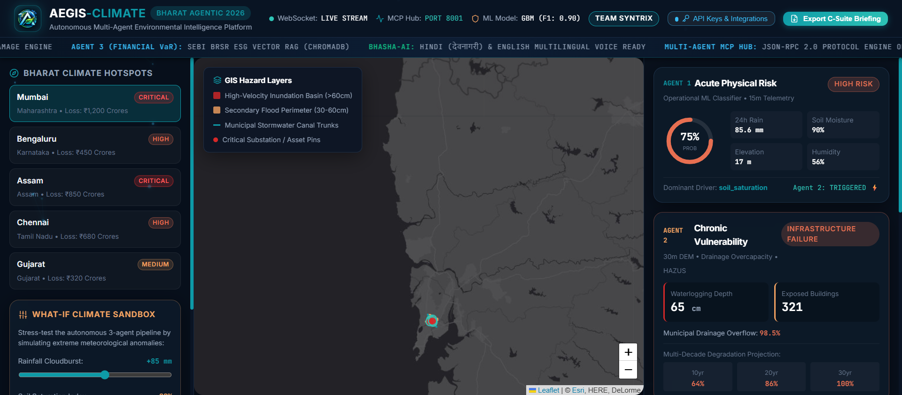

<p align="center">
  
</p>

<div align="center">

# 🛡️ AEGIS-CLIMATE
### *Autonomous Multi-Agent Environmental & Climate Risk Intelligence Platform for Bharat*

> **Translating Environmental Hazards into Actionable Business & Civic Intelligence Across Bharat**

Built for **BHARAT AGENTIC 2026** (Powered by **AIKart** on **Unstop**)  
*12-Hour National Agentic AI Hackathon Sprint*

[](https://github.com/Niss54/AEGIS)
[](#-domain--bharat-impact)
[](#-model-context-protocol-mcp-gateway)
[](#-team-syntrix)
[](#-automated-testing--verification)
[](#-aikart-hackathon-official-submission-methods)


[📋 Guidelines](./HACKATHON_GUIDELINES.md) · [📑 Product Requirements (PRD)](./PRD.md) · [📊 Pitch Deck](./docs/PITCH_DECK.md) · [🎬 Demo Script](./docs/DEMO_SCRIPT.md) · [🤖 Agent Manifest](./agent_manifest.yaml)

</div>

---

## 🌊 The Hook: Why AEGIS Exists

India experiences some of the most volatile meteorological phenomena on the planet — catastrophic monsoon cloudbursts in Mumbai, urban lake-breach waterlogging across Bengaluru's tech parks, Brahmaputra riverine floods across Assam, and coastal cyclones inundating Chennai industrial corridors. 

Yet today, **a fatal operational disconnect paralyzes disaster response:**
- **Petabytes of raw data exist in silos:** Satellite rasters, Open-Meteo feeds, 30m Digital Elevation Models (DEM), municipal drainage networks, and hundreds of pages of SEBI BRSR and NDMA climate policies.
- **Decision-makers receive fragmented, delayed reports:** Disaster response authorities react hours after arterial highways drown; municipal engineers lack parcel-level water accumulation projections; and enterprise CFOs face uncalculated balance-sheet Value-at-Risk (VaR) and punitive regulatory penalties under SEBI BRSR Principle 6 mandates.

**AEGIS-CLIMATE** bridges this chasm by deploying an **Autonomous Hub-and-Spoke Multi-Agent Architecture** powered by the **Model Context Protocol (MCP)** and **LangGraph**. It translates physical weather vectors into immediate operational alerts, multi-decade structural vulnerability projections, and enterprise financial risk under one unified pane of glass.

---

## 🎬 Live Mission-Control Cockpit

<p align="center">
  
</p>

<div align="center">

| 🛰️ Interactive Esri GIS Basemap | ⚡ Real-Time ML Hazard Gauges | 🧪 "What-If" Anomaly Sandbox | 🎙️ Bhasha-AI Neural Voice |
|:---:|:---:|:---:|:---:|
| Multi-layer flood polygon inundation contours & canal vector overlays | XGBoost flash-flood probability (0–100%) with 15-minute telemetry refresh | Dynamic precipitation slider (+0mm to +200mm) triggering live re-planning | Sarvam AI (Devanagari Hindi) & ElevenLabs (English) live audio broadcast |

</div>

---

## 📋 Table of Contents

- [🛡️ AEGIS-CLIMATE](#️-aegis-climate)
  - [🌊 The Hook: Why AEGIS Exists](#-the-hook-why-aegis-exists)
  - [🎬 Live Mission-Control Cockpit](#-live-mission-control-cockpit)
  - [📋 Table of Contents](#-table-of-contents)
  - [🤖 The Multi-Agent Ecosystem](#-the-multi-agent-ecosystem)
  - [✨ Key Platform Features](#-key-platform-features)
  - [🏛️ System Architecture](#️-system-architecture)
  - [🔌 Model Context Protocol (MCP) Gateway](#-model-context-protocol-mcp-gateway)
  - [🛠️ Tech Stack](#️-tech-stack)
  - [🚀 Getting Started](#-getting-started)
    - [Prerequisites](#prerequisites)
    - [Local Installation](#local-installation)
    - [Docker Compose Quickstart](#docker-compose-quickstart)
  - [⚙️ Environment Configuration Matrix](#️-environment-configuration-matrix)
  - [📡 REST API & WebSocket Reference](#-rest-api--websocket-reference)
  - [🧪 Automated Testing & Verification](#-automated-testing--verification)
  - [📦 aiKart Hackathon Official Submission Methods](#-aikart-hackathon-official-submission-methods)
    - [Method 1: YAML / Agent Manifest Submission](#method-1-yaml--agent-manifest-submission)
    - [Method 2: Hosted API Endpoint Submission](#method-2-hosted-api-endpoint-submission)
  - [👥 Team Syntrix](#-team-syntrix)
  - [📄 License & Acknowledgments](#-license--acknowledgments)

---

## 🤖 The Multi-Agent Ecosystem

AEGIS deploys **three autonomous, decoupled AI agents** executing in strict accordance with the **Understand ➔ Reason ➔ Plan ➔ Use Tools ➔ Act ➔ Deliver** cycle:

```
┌──────────────┐     ┌──────────┐     ┌──────────┐
│  UNDERSTAND  │ ──> │  REASON  │ ──> │   PLAN   │
└──────────────┐     └──────────┘     └──────────┘
                                            │
                                            ▼
┌──────────────┐     ┌──────────┐     ┌──────────┐
│   DELIVER    │ <── │   ACT    │ <── │ USE TOOLS│
└──────────────┘     └──────────┘     └──────────┘
```

| Agent Spec | Agent 1: Acute Physical Risk | Agent 2: Chronic Vulnerability | Agent 3: Macro Transition & Financial VaR |
| :--- | :--- | :--- | :--- |
| **Operational Horizon** | **Immediate (0 – 24 Hours)** | **Tactical & Strategic (10 – 30 Years)** | **Executive & Boardroom (Corporate Balance Sheet)** |
| **Core Engine** | Gradient Boosting Classifier (95.14% CV Accuracy) | 30m SRTM DEM Spatial Elevation + GeoPandas | ChromaDB Cosine Similarity RAG + Multi-LLM Reasoning |
| **Input Vectors** | 24h/7d Rain, Soil Saturation %, Humidity, Elevation | Topographical Depressions, Inundation Depth, Drainage Capacity | Physical Asset Loss, SEBI BRSR Mandates, Carbon Penalties |
| **Autonomous Trigger** | Telemetry ingestion on target coordinate `(lat, lon)` | Automatically triggered when **Agent 1 Risk Score > 0.65** | Automatically triggered when **Agent 2 Tier == INFRASTRUCTURE_FAILURE** |
| **MCP Tools Called** | `fetch_weather_vectors`, `run_flood_classifier` | `compute_dem_exposure` | `query_policy_rag` |
| **Key Output** | Flash flood probability `[0.0 - 1.0]`, Risk Tier (`CRITICAL/HIGH/MED/LOW`) | Waterlogging depth (cm), Exposed building count, Infrastructure Choke % | Value-at-Risk (INR/USD), Stranded asset risk, Bilingual Hindi/English Dispatch |

---

## ✨ Key Platform Features

### 1. 🤖 Autonomous Cascade Orchestration
- **Conditional Triggering:** Agents do not run blindly. High-risk acute flash-flood signals automatically instantiate the spatial DEM engine, which in turn feeds the financial VaR auditor.
- **Agent Thought Log & Tool Trace:** Live streaming drawer showing the internal reasoning monologue (`THOUGHT`, `TOOL_INVOCATION`, `OBSERVATION`, `DECISION`).

### 2. 🗺️ Precision Geospatial & 30m DEM Terrain Modeling
- **High-Velocity Inundation Polygons:** GeoJSON spatial overlays mapping 60cm+ deep submersion corridors versus secondary perimeter buffers.
- **Municipal Canal Choke Analysis:** Identifies drainage network overload rates (e.g., 98.5% capacity breach in Mumbai Mithi Basin).

### 3. 💼 Enterprise Value-at-Risk (VaR) & Regulatory RAG
- **Four-Pillar Financial Quantification:** Combines direct structural reconstruction costs, business interruption downtime, SEBI BRSR non-disclosure fines, and insurance premium surges.
- **ChromaDB Policy Corpus:** Pre-indexed vector store containing SEBI BRSR Core Mandates, National Disaster Management Authority (NDMA) Urban Flood Guidelines, and Carbon Tax Schemes.

### 4. 🗣️ Bhasha-AI Bilingual Voice Dispatch
- **Sarvam AI (`hi-IN`)**: Synthesizes genuine Devanagari Hindi neural speech using the native `priya` voice model for field emergency services.
- **ElevenLabs Multilingual**: Streams broadcast-grade executive English alerts for corporate boardrooms and C-suite briefings.
- **Resilient Fallback**: Graceful automatic cross-engine failover and browser Web Speech API support.

### 5. 🧪 Interactive "What-If" Climate Anomaly Sandbox
- Real-time slider allowing judges to simulate catastrophic cloudbursts (+0mm to +200mm rainfall) and watch the three agents re-plan, re-classify, and re-calculate Value-at-Risk dynamically.

### 6. 📄 1-Click C-Suite Executive Briefing Exporter
- Generates a print-ready, high-resolution A4 executive dossier (`GET /api/v1/events/{id}/executive-briefing/html`) equipped with team signatures, NDMA audit seals, and financial impact breakdowns.

---

## 🏛️ System Architecture

```
                  ┌──────────────────────────────────────────────┐
                  │       MISSION-CONTROL COCKPIT (VITE/REACT)   │
                  │ (Particle Canvas, Esri GIS Map, Audio Waves) │
                  └──────────────────────┬───────────────────────┘
                                         │ REST / WebSockets
                                         ▼
                  ┌──────────────────────────────────────────────┐
                  │            FASTAPI CORE ENGINE (Port 8000)   │
                  │   (/api/v1/analyze · /api/v1/bhasha/tts)     │
                  └──────────────────────┬───────────────────────┘
                                         │ JSON-RPC 2.0
                                         ▼
                  ┌──────────────────────────────────────────────┐
                  │        MCP HUB GATEWAY (Port 8001 & 8000)    │
                  │ (Dynamic Tool Registry · Official MCP Spec)  │
                  └──────┬────────────────┬───────────────┬──────┘
                         │                │               │
         ┌───────────────┘                │               └───────────────┐
         ▼                                ▼                               ▼
┌──────────────────┐            ┌──────────────────┐            ┌──────────────────┐
│     AGENT 1      │            │     AGENT 2      │            │     AGENT 3      │
│  ACUTE PHYSICAL  │            │ CHRONIC CLIMATE  │            │ MACRO TRANSITION │
│    RISK AGENT    │            │VULNERABILITY AGT │            │ & FINANCIAL RISK │
├──────────────────┤            ├──────────────────┤            ├──────────────────┤
│• Open-Meteo Live │ Score>0.65 │• GeoPandas + DEM │ High-Risk  │• ChromaDB RAG    │
│• XGBoost Model   │───────────>│• Drainage Matrix │───────────>│• Groq/Gemini LLM │
│• 15-min Refresh  │            │• HAZUS Exposure  │            │• Value at Risk   │
└──────────────────┘            └──────────────────┘            └──────────────────┘
```

### Detailed Execution Sequence

```mermaid
sequenceDiagram
    autonumber
    actor User as Disaster Officer / CRO
    participant UI as Mission-Control Cockpit
    participant API as FastAPI Backend (Port 8000)
    participant MCP as MCP Hub Gateway (Port 8001)
    participant A1 as Agent 1 (Acute ML)
    participant A2 as Agent 2 (Chronic DEM)
    participant A3 as Agent 3 (Financial VaR)
    participant TTS as Bhasha-AI Voice Engine

    User->>UI: Selects Hotspot (e.g. Mumbai Mithi Basin) & Clicks Analyze
    UI->>API: POST /api/v1/analyze {lat, lon, sim_rain}
    API->>MCP: JSON-RPC 2.0: fetch_weather_vectors(lat, lon)
    MCP-->>API: Returns 24h precip (85.6mm), soil sat (90%)
    API->>MCP: JSON-RPC 2.0: run_flood_classifier(vectors)
    MCP-->>A1: Execute GradientBoostingClassifier
    A1-->>API: Flash Flood Risk = 0.75 (CRITICAL)
    
    rect rgb(30, 41, 59)
    note over API, A2: Autonomous Trigger: Score > 0.65 breaches Acute Safety Threshold
    API->>MCP: JSON-RPC 2.0: compute_dem_exposure(lat, lon, score)
    MCP-->>A2: 30m SRTM DEM + Drainage Choke Overlap
    A2-->>API: 65cm waterlogging depth, 321 exposed structures
    end

    rect rgb(44, 24, 16)
    note over API, A3: Autonomous Trigger: Exposure Tier == INFRASTRUCTURE_FAILURE
    API->>MCP: JSON-RPC 2.0: query_policy_rag("SEBI BRSR Principle 6 penalties")
    MCP-->>A3: Vector Cosine Search (ChromaDB) + Groq Sub-400ms LLM
    A3-->>API: VaR = ₹3,450 Cr ($41.5M), Stranded Asset = HIGH
    end

    API->>TTS: POST /api/v1/bhasha/tts (Devanagari Hindi + English)
    TTS-->>API: Returns Base64 Neural Audio (Sarvam AI / ElevenLabs)
    API-->>UI: Complete Multi-Agent Assessment Dossier
    UI-->>User: Renders Map Polygons, Gauges, Thought Trace & Plays Audio
```



---

## 🔌 Model Context Protocol (MCP) Gateway

AEGIS implements a full, specification-compliant **Model Context Protocol (MCP)** server over **JSON-RPC 2.0** on **Port 8001** and mounted directly on the primary backend (**Port 8000**):

### Protocol Handshake & Tool Discovery
1. **Initialize (`method: "initialize"`)**: Returns server capabilities, protocol version (`2024-11-05`), and tool registration status.
2. **Tools List (`method: "tools/list"`)**: Catalogs available tools, descriptive schemas, and target agent bindings.
3. **Tool Call (`method: "tools/call"`)**: Standard MCP tool dispatch with structured arguments and sandboxed execution.
4. **Direct Tool Invocation**: Zero-overhead JSON-RPC 2.0 tool execution for real-time streaming agents.

### Registered Tool Registry

| Tool Method | Target Agent | Parameters | Description |
| :--- | :--- | :--- | :--- |
| `fetch_weather_vectors` | `agent-1-acute` | `lat` (float), `lon` (float) | Fetches live precipitation, antecedent rainfall, soil moisture, and humidity from Open-Meteo API. |
| `run_flood_classifier` | `agent-1-acute` | `precipitation_24h_mm`, `soil_saturation_pct`, etc. | Executes trained Gradient Boosting ML model to predict flash flood probability `[0.0 - 1.0]`. |
| `compute_dem_exposure` | `agent-2-chronic` | `lat`, `lon`, `risk_score`, `radius_km` | Ingests 30m SRTM Digital Elevation Models and drainage network data to model inundation depth (cm). |
| `query_policy_rag` | `agent-3-financial` | `query` (string), `top_k` (int) | Cosine similarity vector query against ChromaDB climate policy corpus (SEBI BRSR, NDMA guidelines). |

---

## 🛠️ Tech Stack

<div align="center">

| Layer | Technologies |
| :--- | :--- |
| **Agentic Core & MCP** |    |
| **AI & Neural Speech** |      |
| **Geospatial & Earth Observation** |      |
| **Backend & Services** |     |
| **Database & Vector Store** |    |
| **Frontend Cockpit** |    |
| **DevOps & Containers** |    |

</div>

---

## 🚀 Getting Started

### Prerequisites
- **Python**: `>= 3.11` (Python 3.12 recommended)
- **Node.js**: `>= 18.0.0`
- **Docker & Docker Compose** (Optional, for full containerized deployment)

### Local Installation

```bash
# 1. Clone the repository
git clone https://github.com/Niss54/AEGIS.git
cd AEGIS

# 2. Setup environment variables
cp .env.example .env
# Edit .env and supply your API keys (GROQ_API_KEY, SARVAM_API_KEY, ELEVENLABS_API_KEY, MAPBOX_API_TOKEN)

# 3. Setup and start Backend & MCP Hub
pip install -r backend/requirements.txt
# Launch FastAPI Core Backend (Port 8000)
py -3.12 -m uvicorn backend.app.main:app --host 127.0.0.1 --port 8000

# In a second terminal, launch standalone MCP Hub (Port 8001)
py -3.12 -m uvicorn mcp_hub.hub:app --host 127.0.0.1 --port 8001

# 4. Setup and start Frontend Cockpit
cd frontend
npm install
npm run dev
# Dashboard opens on http://127.0.0.1:5173
```

<details>
<summary>🪟 Windows PowerShell Quickstart (Copy-Paste Ready)</summary>

```powershell
# Open Windows Terminal in AEGIS root:
py -3.12 -m uvicorn backend.app.main:app --port 8000
# In second PowerShell tab:
py -3.12 -m uvicorn mcp_hub.hub:app --port 8001
# In third PowerShell tab:
cd frontend; npm run dev
```

</details>

### Docker Compose Quickstart

```bash
# Spin up full containerized stack (PostGIS, ChromaDB, MCP Hub, Backend, Frontend):
docker compose up -d --build
```

---

## ⚙️ Environment Configuration Matrix

| Variable | Type | Required | Description |
| :--- | :---: | :---: | :--- |
| `GROQ_API_KEY` | `string` | **Recommended** | High-speed LLM inference key for sub-400ms Agent Thought Trace monologue (`openai/gpt-oss-120b`). |
| `SARVAM_API_KEY` | `string` | **Recommended** | Bhasha-AI key for native Devanagari Hindi neural speech synthesis (`priya` speaker). |
| `ELEVENLABS_API_KEY` | `string` | **Recommended** | High-fidelity voice synthesis key for English boardroom & C-suite voice dispatch. |
| `MAPBOX_API_TOKEN` | `string` | Optional | Mapbox token for high-resolution satellite tiles and 3D terrain rasters. |
| `GEMINI_API_KEY` | `string` | Optional | Google Gemini 1.5 Flash key for fallback multi-modal reasoning. |
| `OPENMETEO_BASE_URL` | `string` | Default Active | Base URL for live weather telemetry (`https://api.open-meteo.com/v1`). Free tier enabled by default. |
| `ACUTE_RISK_TRIGGER_THRESHOLD` | `float` | Default `0.65` | Probability threshold triggering autonomous cascade from Agent 1 to Agent 2. |
| `CHRONIC_DAMAGE_THRESHOLD` | `float` | Default `0.70` | Severity threshold triggering autonomous cascade from Agent 2 to Agent 3. |

---

## 📡 REST API & WebSocket Reference

### 1. `POST /api/v1/analyze`
Executes complete autonomous multi-agent climate hazard analysis.

```bash
curl -X POST "http://127.0.0.1:8000/api/v1/analyze" \
     -H "Content-Type: application/json" \
     -d '{
       "lat": 19.0728,
       "lon": 72.8797,
       "location_name": "Mumbai — Mithi River & Kurla Basin",
       "simulated_additional_rain_mm": 50.0
     }'
```

### 2. `POST /api/v1/bhasha/tts`
Synthesizes authentic bilingual neural audio dispatch (Sarvam AI for Hindi, ElevenLabs for English).

```bash
curl -X POST "http://127.0.0.1:8000/api/v1/bhasha/tts" \
     -H "Content-Type: application/json" \
     -d '{
       "text": "सावधान, मुंबई क्षेत्र में भारी जलभराव की चेतावनी है।",
       "language": "hi",
       "speaker": "priya"
     }'
```

### 3. `POST /mcp/invoke`
Official Model Context Protocol (MCP) JSON-RPC 2.0 tool execution endpoint.

```bash
curl -X POST "http://127.0.0.1:8001/mcp/invoke" \
     -H "Content-Type: application/json" \
     -d '{
       "jsonrpc": "2.0",
       "method": "run_flood_classifier",
       "params": {
         "precipitation_24h_mm": 110.0,
         "precipitation_7d_mm": 250.0,
         "soil_saturation_pct": 88.0,
         "relative_humidity_pct": 90.0,
         "elevation_m": 8.0,
         "drainage_capacity_index": 50.0
       },
       "id": "req-1"
     }'
```

### 4. `WS /ws/events`
Real-time bidirectional WebSocket stream broadcasting live thought traces, agent status tokens, and instant threshold breach alerts.

---

## 🧪 Automated Testing & Verification

AEGIS includes a comprehensive automated test suite verifying every component end-to-end:

```bash
# 1. Run Official MCP Server End-to-End Test Suite (10/10 Tests)
py -3.12 tests/test_mcp_end_to_end.py

# 2. Run Phase 6 Winning Edge Integration Suite
py -3.12 tests/test_phase6_winning_edge.py

# 3. Run Agent 1 Acute ML Core Suite
py -3.12 tests/test_agent1.py

# 4. Run Agent 2 Geospatial & DEM Suite
py -3.12 tests/test_agent2.py

# 5. Run Agent 3 Financial VaR & ChromaDB RAG Suite
py -3.12 tests/test_agent3.py
```

### Test Results

```text
Running end-to-end MCP Server test suite...
[PASS] test_mcp_health_standalone passed (Port 8001)
[PASS] test_mcp_health_backend_mounted passed (Port 8000)
[PASS] test_mcp_rest_tools_catalog passed
[PASS] test_mcp_handshake_initialize passed
[PASS] test_mcp_protocol_tools_list passed
[PASS] test_mcp_protocol_tools_call_weather passed
[PASS] test_mcp_direct_invoke_flood_classifier passed
[PASS] test_mcp_direct_invoke_dem_exposure passed
[PASS] test_mcp_direct_invoke_policy_rag passed
[PASS] test_mcp_error_handling_unknown_method passed

>>> ALL 10 MCP END-TO-END TESTS PASSED 100%! <<<
```

---

## 📦 aiKart Hackathon Official Submission Methods

### Method 1: YAML / Agent Manifest Submission
As mandated by the aiKart hackathon specifications, AEGIS provides an official containerized manifest:
- **Manifest File:** [`agent_manifest.yaml`](./agent_manifest.yaml)
- **Container Entrypoint:** [`Dockerfile`](./Dockerfile)
- **Compose Multi-Service:** [`docker-compose.yml`](./docker-compose.yml)

### Method 2: Hosted API Endpoint Submission
- **Primary Endpoint:** `POST /api/v1/analyze`
- **Protocol Gateway:** `POST /mcp/invoke`
- **Health Check:** `GET /api/v1/health`
- **Live Local Demo:** `http://127.0.0.1:5173`

---

## 👥 Team Syntrix

Proudly built during the 12-hour sprint of **BHARAT AGENTIC 2026**:


---

## 📄 License & Acknowledgments

- **License:** MIT Open Source License. See [LICENSE](./LICENSE) for details.
- **Meteorological Data:** Courtesy of [Open-Meteo API](https://open-meteo.com/) (Open-access community license).
- **Cartographic Basemaps:** Courtesy of Esri World Dark Gray Canvas and Mapbox.
- **Hackathon Platform:** Powered by **AIKart** on **Unstop** for **BHARAT AGENTIC 2026**.

- ## 👥 Team Syntrix

Proudly built during the 12-hour sprint of **BHARAT AGENTIC 2026**:

